# UTS PEMROGRAMAN ANDROID - RIAD SIHARA

aplikasi social media chat dengan firebase berikut adalah nama kelompok nya. database menggunakan <b>Firebase</b> yang dimana data nya tersimpan di server google yang menjalankan layanan firestore.

## <b>LINK DATABASE 💾 APLIKASI : <a href="https://github.com/RahmanIslamIen/IndonesiaChat/blob/main/dataBaseAplikasi_IndonesiaChat.json" target="_blank">dataBaseAplikasi_IndonesiaChat.json</a></b>

## <b>LINK DEMO APLIKASI : <a href="https://youtu.be/Us2LtXLWbG4" target="_blank">https://youtu.be/Us2LtXLWbG4</a></b>

<b>Nama Kelompok</b>

<ul>
  <li>411211069 - RAHMAN ISLAM
  <a href="https://docs.google.com/document/d/1Ay5BbHuhk4bUWUFFaArBCGLPs4onZ6Ah/edit?usp=sharing&ouid=111728269137145342838&rtpof=true&sd=true">
  https://docs.google.com/document/d/1Ay5BbHuhk4bUWUFFaArBCGLPs4onZ6Ah/edit?usp=sharing&ouid=111728269137145342838&rtpof=true&sd=true
  </a>
  </li>
  <li>411211057 - ISATI GULO
  <a href="https://docs.google.com/document/d/1ggHq3OIsZlhRju5H9SFyKZKDmt33Lf5o/edit?usp=sharing&ouid=117322445828428946794&rtpof=true&sd=true">
  https://docs.google.com/document/d/1ggHq3OIsZlhRju5H9SFyKZKDmt33Lf5o/edit?usp=sharing&ouid=117322445828428946794&rtpof=true&sd=true
  </a>
  </li>
  <li>411211138 - ROBBY CAHYADI
  <a href="https://docs.google.com/document/d/11oHCy4gXSsBqaN2ZszRDwZtgJkhDOUAV/edit?usp=sharing&ouid=111728269137145342838&rtpof=true&sd=true">
  https://docs.google.com/document/d/11oHCy4gXSsBqaN2ZszRDwZtgJkhDOUAV/edit?usp=sharing&ouid=111728269137145342838&rtpof=true&sd=true
  </a>
  </li>
</ul>
    
## HASIL SCREENSHOOT

  <table>
    <tr>
      <td>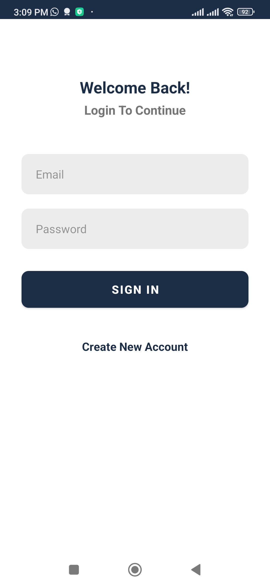</td>
      <td>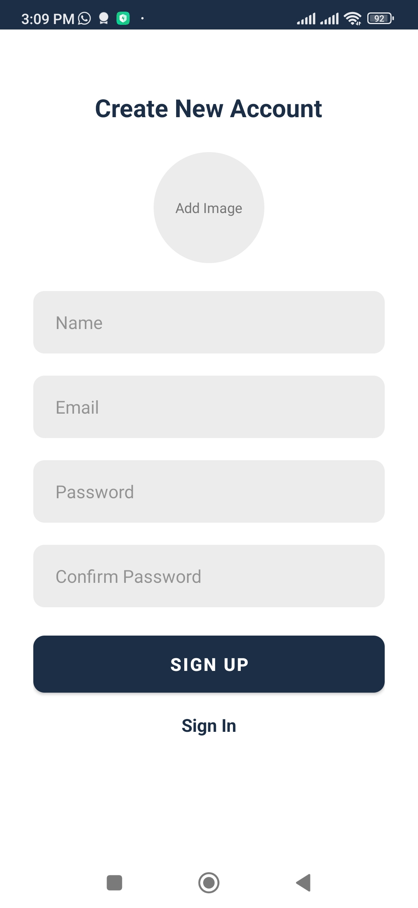</td>
      <td>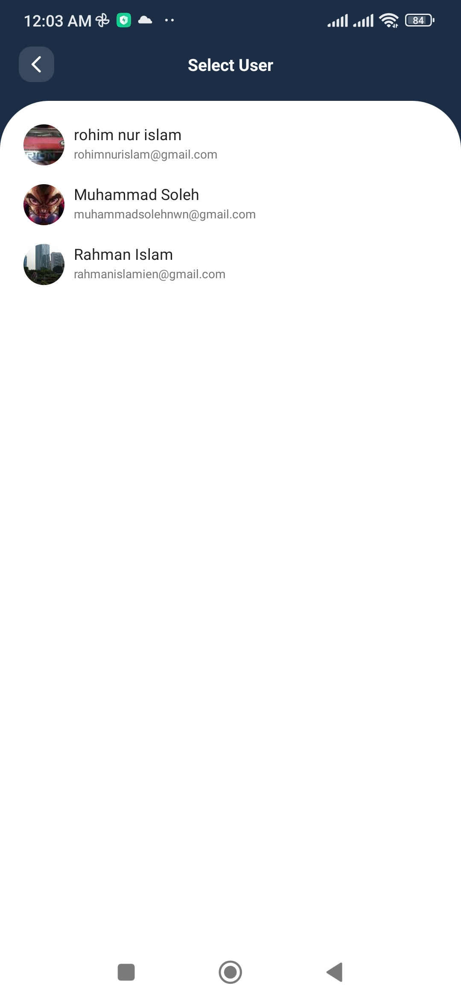</td>
      <td>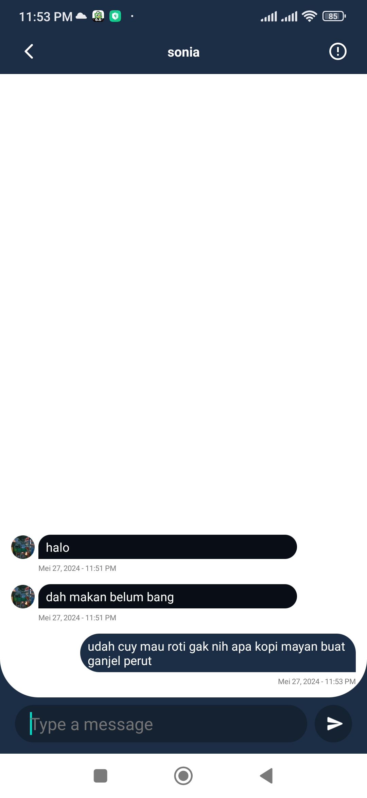</td>
    </tr>
    <tr>
      <td>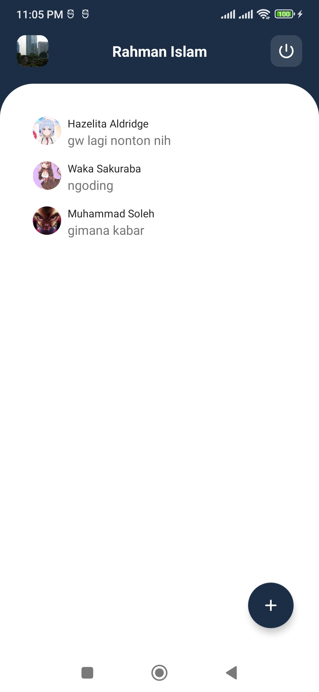</td>
      <td>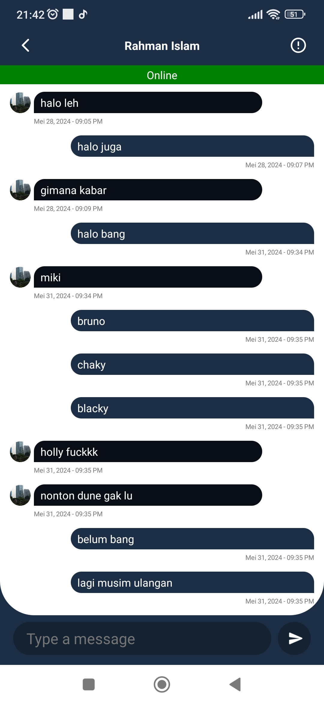</td>
      <td>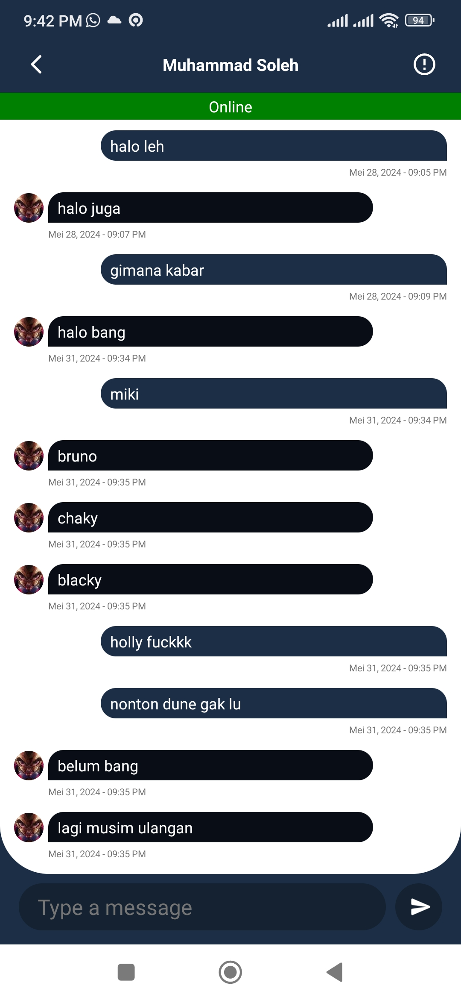</td>
      <td>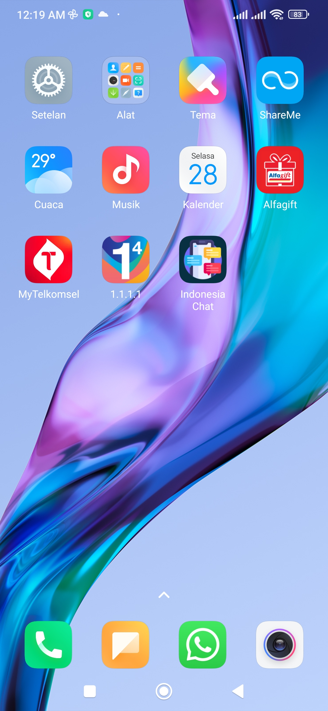</td>
    </tr>
  </table>

## Database Pada Aplikasi Indoensia Chat | Firebase - Firestore

<table>
  <tr>
    <td>data base yang tersimpan.</td>
    <td>grafik penggunaan database pada firestore.</td>
    <td>prosees saat expor database</td>
  </tr>
  <tr>
    <td>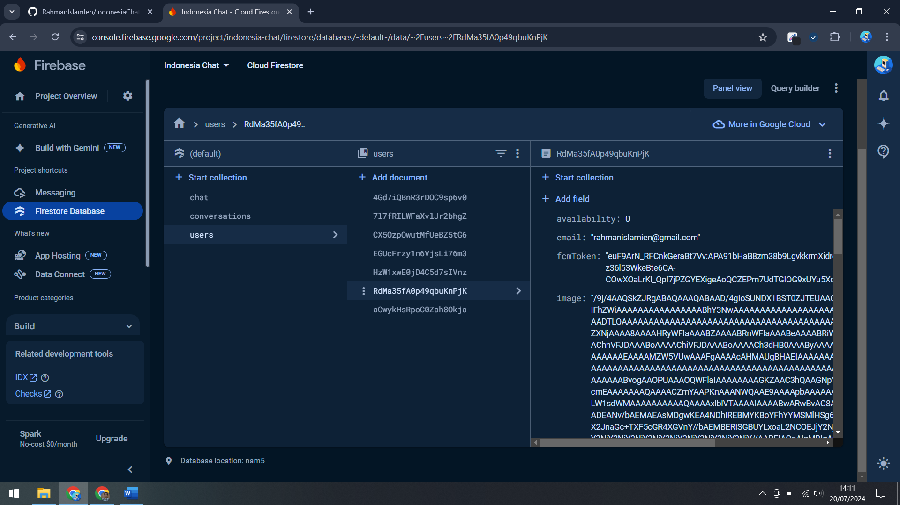</td>
    <td>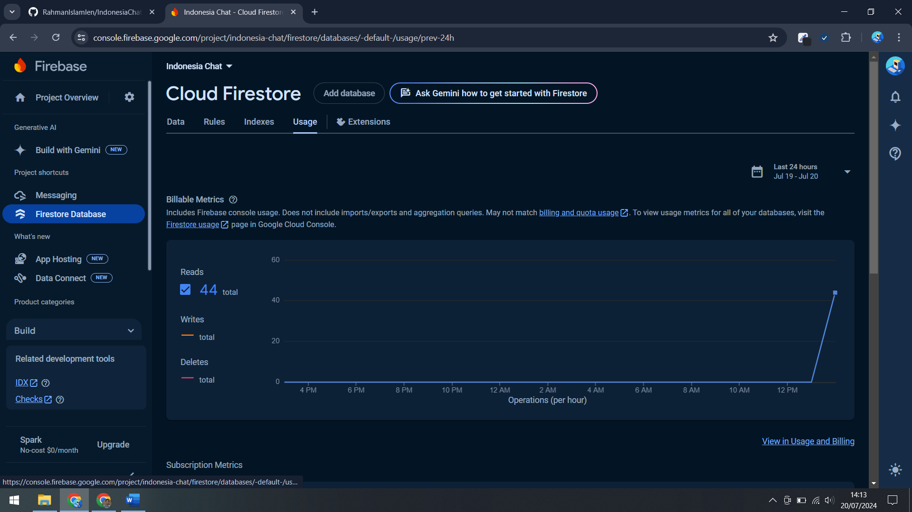</td>
    <td>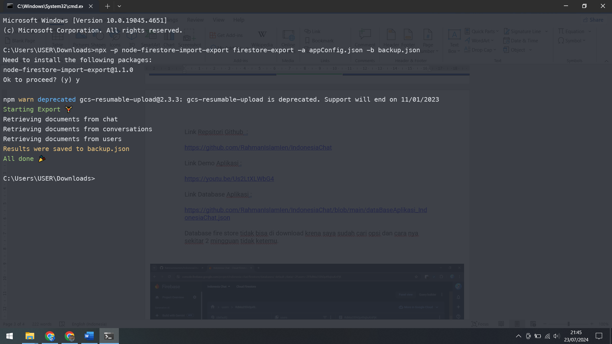</td>
  </tr>
</table>
